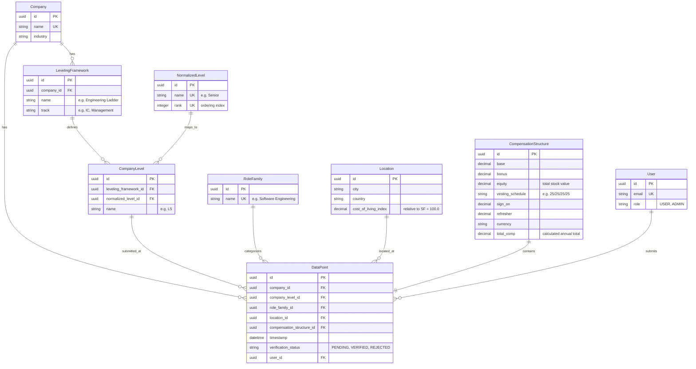

# Compensation Intelligence Platform

A leveling-first compensation comparison and benchmarking platform. The core principle: **levels matter more than job titles**. A "Senior Engineer" at one company and a "Staff Engineer" at another might represent the same level — this platform models and compares compensation on a normalized scale, not raw title strings.

---

## 1. System Architecture

The project is structured as a typed monorepo/workspace containing two primary services:
- **Backend (`/backend`)**: Built with **Fastify (Node.js/TypeScript)**, **Prisma ORM**, and **PostgreSQL** (with custom SQLite toggle for local development). Follows a clear layered architecture:
  `Routes/Controllers` ➔ `Services (Aggregation & COL adjustment logic)` ➔ `Repositories (Database queries via Prisma)`.
- **Frontend (`/frontend`)**: Built with **React (Next.js/TypeScript)** and styled using pure **Vanilla CSS** for high-information density, featuring dark-mode aesthetics, custom distributions, percentiles gauges, and moderation panels.

---

## 2. Database Schema & Extensibility

The data model is relational and designed for maximum extensibility. Adding a new company's framework or a new functional role family requires **zero database schema migrations — only inserting new data rows.**

### ER Diagram (Mermaid)



### Extending the Schema with a New Company (No Migrations)
To add a new company and map its levels:
1. Insert a row into the `Company` table.
2. Insert a row into the `LevelingFramework` table linking it to the company.
3. For each level on the company's internal ladder (e.g. E3, E4, E5), insert a row into `CompanyLevel` referencing your framework and matching it to the correct global `NormalizedLevel` ID (Entry, Mid, Senior, etc.).
4. Add data points referencing those level IDs.

---

## 3. How the Level Normalization & COL Adjustment Works

### Level-Normalized Comparison
Rather than checking salaries for "Senior Engineer" which varies widely by company, the platform groups submissions using `NormalizedLevel`. 
1. The user selects a global standard (e.g., **Senior**).
2. The query maps the standard to company levels (Google's **L5**, Meta's **E5**, and Amazon's **L6**).
3. The platform pulls and aggregates financial details specifically for those levels, ensuring side-by-side comparability.

### Cost-of-Living (COL) / Purchasing Power Index
Salaries are adjusted for location using the `costOfLivingIndex` relative to a baseline (San Francisco = 100.0):
$$\text{Adjusted Total Comp} = \text{Raw Total USD} \times \left(\frac{100.0}{\text{Local COL Index}}\right)$$
*Example:* A $50,000 package in Bengaluru (COL Index = 30.0) scales to a purchasing-power equivalent of $166,667 USD in San Francisco.

---

## 4. Local Quick Start

### Prerequisites
- Node.js v22+
- npm v10+

### Step 1: Install Dependencies
```bash
# Install backend packages
cd backend
npm install

# Install frontend packages
cd ../frontend
npm install
```

### Step 2: Set up SQLite Database (Local Dev)
The project includes a toggle utility script to switch between PostgreSQL (Production) and SQLite (Local Dev) automatically without manual schema edits.
```bash
cd backend
# Convert schema and configure .env for local SQLite
node scripts/toggle-db.js sqlite

# Sync schema and generate Prisma Client
npx prisma db push

# Seed the database with Google, Meta, and Amazon structures
npm run prisma:seed
```

### Step 3: Run the Services
```bash
# Start backend server (listening on http://localhost:8080)
cd backend
npm run dev

# Start frontend server (in a separate terminal - listening on http://localhost:3000)
cd frontend
npm run dev
```

---

## 5. Verification & Testing
To run the automated integration tests verifying compensation calculations, cost-of-living index calculations, and low-data cohort percentile fallbacks:
```bash
cd backend
npm run build
npx tsx src/test-logic.ts
```

---

## 6. Cloud Run Deployment

Both the frontend and backend contain production-ready **Dockerfiles** configured for Google Cloud Run:
- **Backend Dockerfile** automatically executes `node scripts/toggle-db.js postgres` during build, ensuring the production Docker image is compiled cleanly for a Cloud SQL PostgreSQL instance.
- Inject your live connection string via `DATABASE_URL` environment variables on the Cloud Run backend instance.
- Deploy the frontend container pointing `NEXT_PUBLIC_API_URL` to your deployed backend URL.
